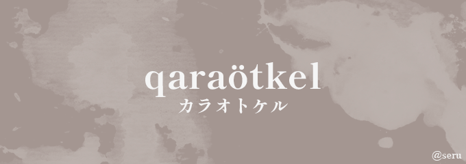

<div align="center">
  
  <h6>My stats:</h6>  
  
  
  
  
  ---
  
  <h6>Me in a nutshell:</h6>
  
  ```mermaid
  graph LR
  A[Inspiration] -- Dreaming of the idea --> B[Making false hopes]
  A -- Telling ppl how busy I am --> C[Doing nothing at all]
  B --> D{Fail}
  C --> D
  D --> A
  ```

</div>

<div align="right">
  
  <p>𐰖𐰁𐰵𐰦𐰁⁚𐰌𐰁𐰼𐰅⁚𐰆𐰬𐰁𐰞𐰁𐰑! 𐰢𐰺𐰚𐰄⁚</p>
  <!-- <p></p> -->
</div>
